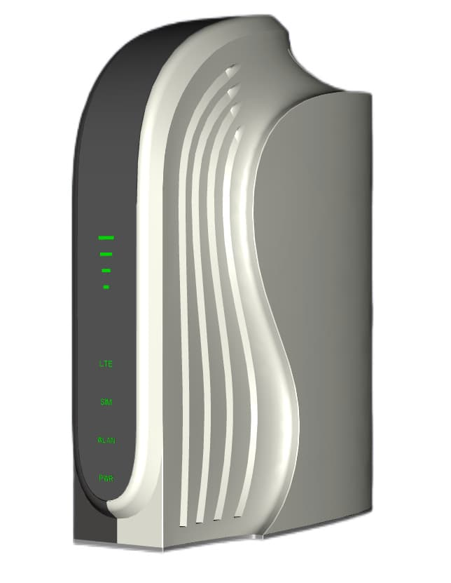

#  BT62i 
## <i>"Advance LTE Wi-Fi Gigabit Router"</i>

### Introduction 

  LTE (Long Term Evolution) is already gaining momentum as the world’s most rapidly deployed cellular technology, giving mobile wireless broadband services to millions of users worldwide. Consumers are increasingly looking for always on, always connected mobile experience delivering high data rate services on small form factor mobile devices whilst at the same time expecting long battery life to minimize recharge cycles. 
BT62i is highly advanced LTE indoor multi-service product solution specifically designed to meet integrated data, and dual bands Wi-Fi access needs for residential, business and enterprise users. 

In this product, we provide Gigabit networking and dual bands Wi-Fi as Access Point functionalities, it enables wide service coverage and provides high data throughput and networking features to customers who needs easy broadband access, hot-spot Wi-Fi connectivity.
